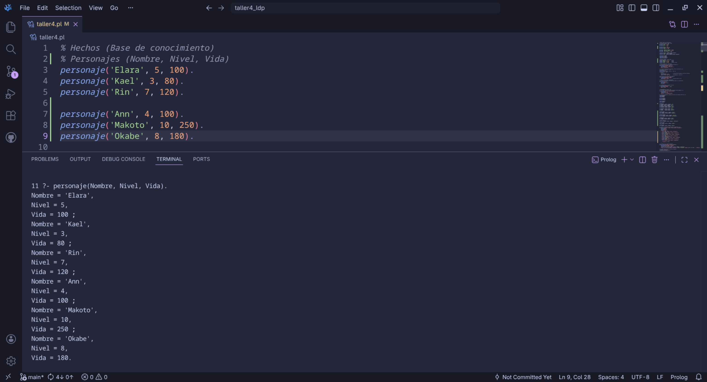
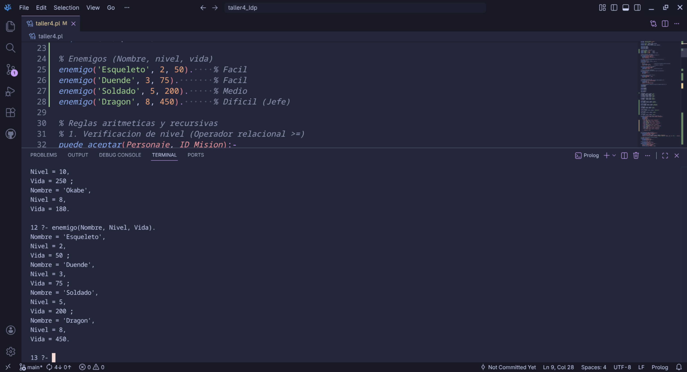
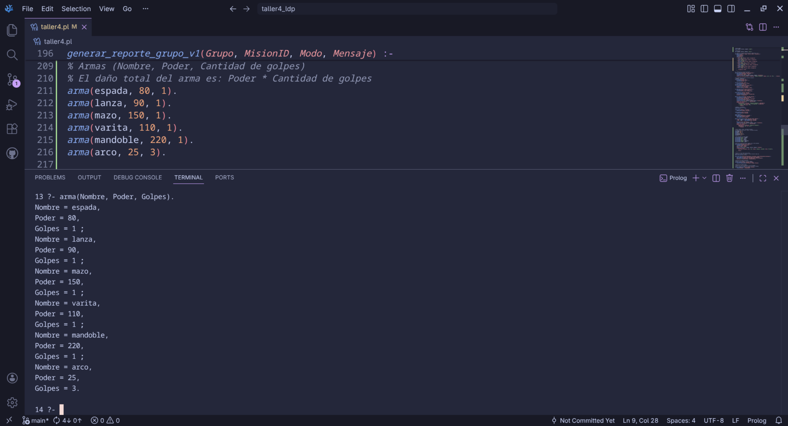
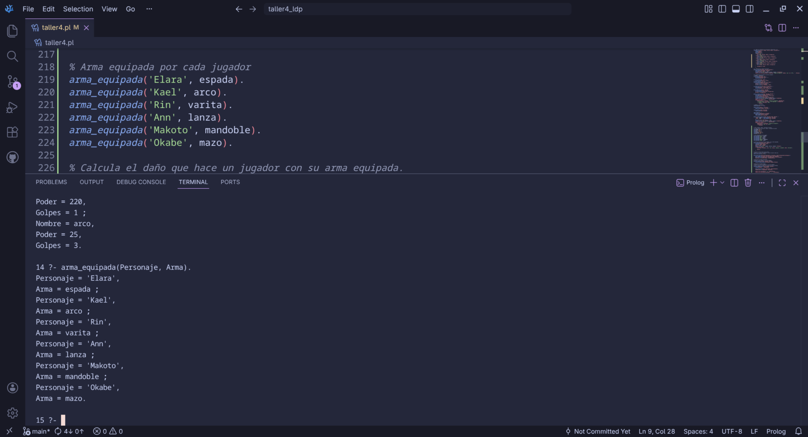
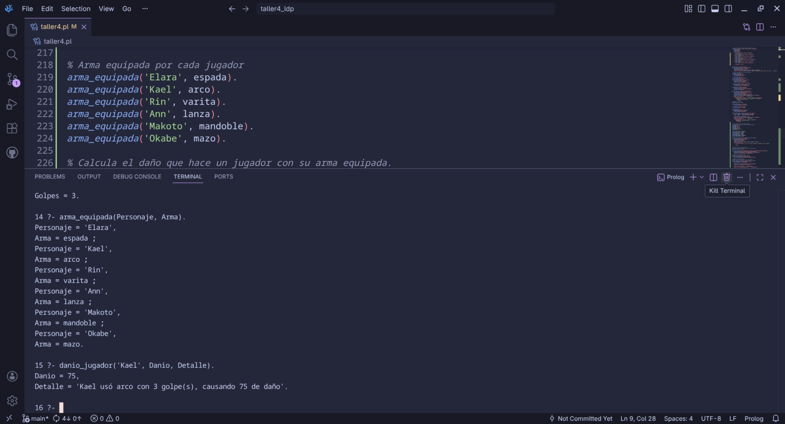
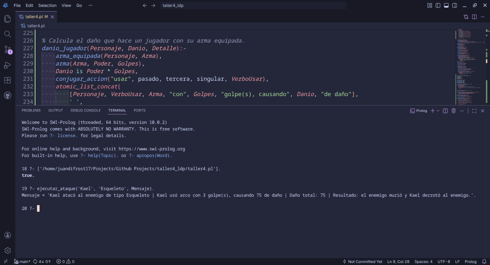
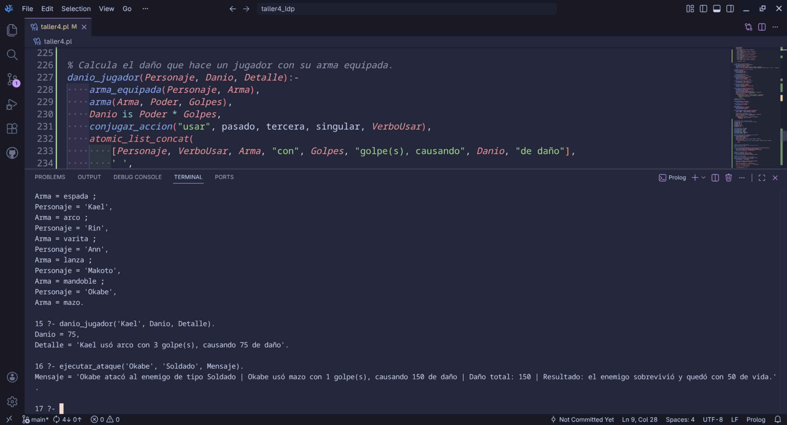
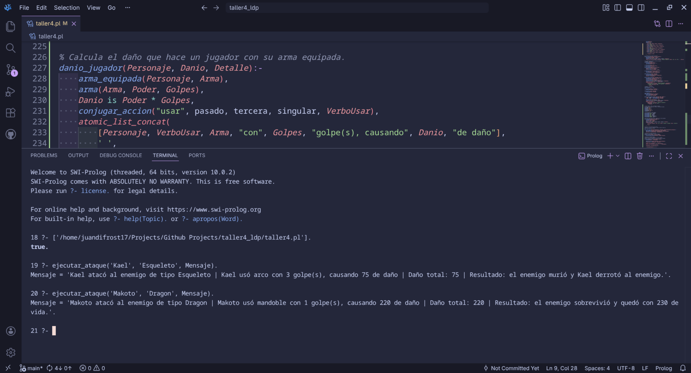
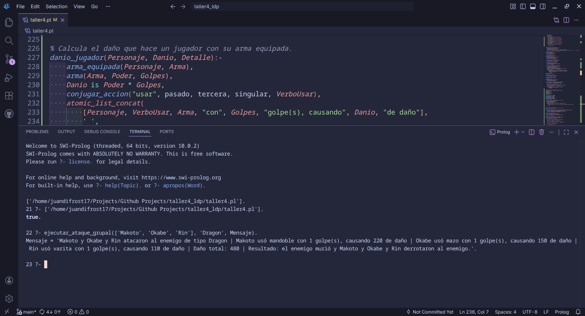
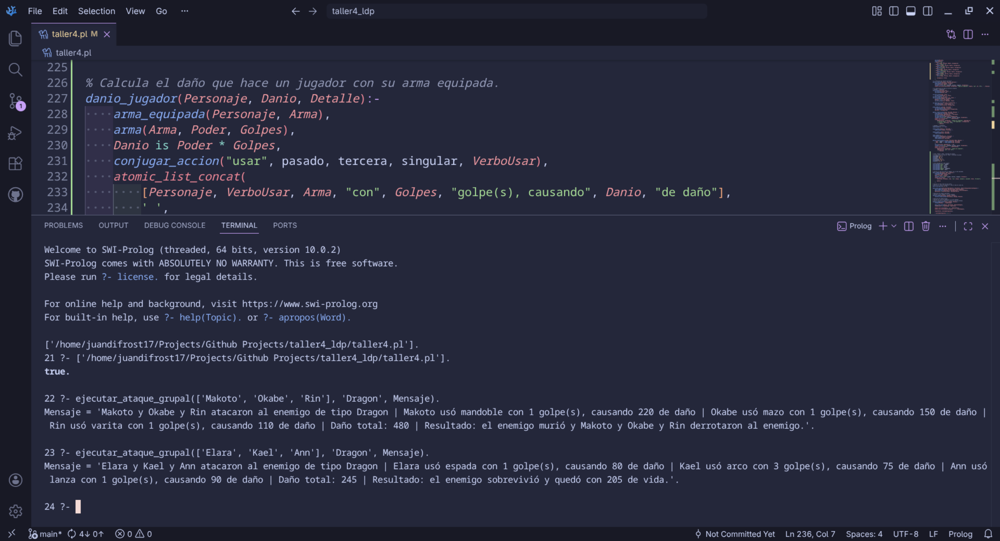

# Taller 5 - Prolog #4 - Sistema de combate RPG

Este taller continúa el sistema RPG desarrollado previamente y agrega una nueva capa de combate. El objetivo principal fue ampliar el juego con enemigos, armas, daño de ataque y ejecución de combates individuales o grupales contra un solo enemigo.

El README se enfoca únicamente en los cambios nuevos del Taller 5, sin repetir la explicación completa del Taller 4.

## Cambios implementados

### Nuevos personajes disponibles para combate

Se agregaron nuevos personajes a la base de conocimiento para ampliar las posibilidades de ataque y formar grupos de combate:

- `Ann`
- `Makoto`
- `Okabe`

Estos personajes se integran al sistema mediante el predicado `personaje/3`, conservando la misma estructura usada en el taller anterior:

```prolog
personaje(Nombre, Nivel, Vida).
```

### Enemigos del sistema de combate

Se incorporaron enemigos con nivel y vida. Estos enemigos son el objetivo de las simulaciones de ataque.

```prolog
enemigo(Nombre, Nivel, Vida).
```

En el sistema actual se incluyen enemigos de dificultad baja, media y un jefe final:

- `Esqueleto`
- `Duende`
- `Soldado`
- `Dragon`

La vida del enemigo es el valor principal utilizado durante el combate, ya que el daño total realizado por el jugador o la party se compara contra esa vida.

### Armas con poder y cantidad de golpes

Se agregó el predicado `arma/3` para representar el poder de ataque de cada arma y la cantidad de golpes que realiza.

```prolog
arma(Nombre, Poder, CantidadDeGolpes).
```

El daño total de un arma se calcula con la siguiente fórmula:

```text
Daño = Poder * CantidadDeGolpes
```

Por ejemplo, el arco tiene un poder menor, pero golpea tres veces:

```prolog
arma(arco, 25, 3).
```

Por lo tanto, su daño total es:

```text
25 * 3 = 75
```

Esto permite mantener un balance simple: algunas armas hacen mucho daño en un solo golpe, mientras que el arco hace varios golpes de menor poder.

### Armas equipadas por personaje

Se agregó el predicado `arma_equipada/2` para indicar qué arma usa cada personaje durante el combate.

```prolog
arma_equipada(Personaje, Arma).
```

Esta parte separa el inventario general del arma usada para atacar. El inventario sigue representando objetos disponibles, mientras que `arma_equipada/2` define específicamente el arma activa de combate.

### Nuevas conjugaciones para mensajes de combate

La regla `conjugar_accion/5` fue ampliada para generar mensajes más claros durante la ejecución del ataque. Ahora soporta verbos relacionados con el combate:

- `atacar`
- `derrotar`
- `usar`
- `sobrevivir`
- `quedar`
- `morir`

Esto permite que los mensajes se adapten según el caso:

- Si ataca un solo jugador: `atacó`, `derrotó`.
- Si ataca una party: `atacaron`, `derrotaron`.
- Si el enemigo no muere: `sobrevivió` y `quedó` con vida restante.

## Reglas nuevas principales

### Cálculo de daño individual

El predicado `danio_jugador/3` calcula el daño que realiza un personaje según su arma equipada.

```prolog
danio_jugador(Personaje, Danio, Detalle).
```

Esta regla obtiene el arma del personaje, consulta el poder y cantidad de golpes del arma, calcula el daño total y genera un detalle narrativo del ataque.

Ejemplo de consulta:

```prolog
?- danio_jugador('Kael', Danio, Detalle).
```

En este caso, Kael usa el arco. Como el arco tiene poder `25` y realiza `3` golpes, el daño total es `75`.

### Cálculo de daño grupal

El predicado `danio_total_party/3` calcula el daño total realizado por una lista de personajes.

```prolog
danio_total_party(Party, DanioTotal, DetallesAtaques).
```

Esta regla usa recursividad para recorrer la lista de jugadores. Calcula el daño del primer personaje, luego calcula el daño del resto de la lista y finalmente suma ambos valores.

Ejemplo:

```prolog
?- danio_total_party(['Makoto', 'Okabe', 'Rin'], DanioTotal, DetallesAtaques).
```

El daño esperado es:

```text
Makoto = 220
Okabe = 150
Rin = 110
Total = 480
```

### Ejecución de ataque individual

El predicado `ejecutar_ataque/3` permite simular el ataque de un solo personaje contra un enemigo.

```prolog
ejecutar_ataque(Personaje, Enemigo, Mensaje).
```

Internamente, esta regla reutiliza la lógica grupal convirtiendo al personaje en una lista de un solo elemento. Esto evita repetir código y mantiene una estructura más limpia.

Ejemplo:

```prolog
?- ejecutar_ataque('Kael', 'Esqueleto', Mensaje).
```

### Ejecución de ataque grupal

El predicado `ejecutar_ataque_grupal/3` permite simular el ataque de varios personajes contra un solo enemigo.

```prolog
ejecutar_ataque_grupal(Party, Enemigo, Mensaje).
```

La regla realiza el siguiente proceso:

1. Obtiene la vida del enemigo.
2. Calcula el daño total de la party.
3. Calcula la vida restante del enemigo.
4. Determina si el mensaje debe ir en singular o plural.
5. Conjuga los verbos necesarios.
6. Genera un mensaje final indicando si el enemigo murió o sobrevivió.

Ejemplo:

```prolog
?- ejecutar_ataque_grupal(['Makoto', 'Okabe', 'Rin'], 'Dragon', Mensaje).
```

Como la party realiza `480` de daño y `Dragon` tiene `450` de vida, el enemigo muere y el mensaje indica que la party derrotó al enemigo.

## Consultas usadas para evidencia

Estas consultas se usaron para comprobar los cambios implementados. En las primeras consultas se deben ir mostrando los resultados con `;` para ver todos los hechos disponibles.

```prolog
?- personaje(Nombre, Nivel, Vida).
```

```prolog
?- enemigo(Nombre, Nivel, Vida).
```

```prolog
?- arma(Nombre, Poder, Golpes).
```

```prolog
?- arma_equipada(Personaje, Arma).
```

```prolog
?- danio_jugador('Kael', Danio, Detalle).
```

```prolog
?- ejecutar_ataque('Kael', 'Esqueleto', Mensaje).
```

```prolog
?- ejecutar_ataque('Okabe', 'Soldado', Mensaje).
```

```prolog
?- ejecutar_ataque('Makoto', 'Dragon', Mensaje).
```

```prolog
?- ejecutar_ataque_grupal(['Makoto', 'Okabe', 'Rin'], 'Dragon', Mensaje).
```

```prolog
?- ejecutar_ataque_grupal(['Elara', 'Kael', 'Ann'], 'Dragon', Mensaje).
```

## Capturas de ejecución

### Captura 1 — Consulta de personajes



Esta captura muestra los personajes registrados en el sistema mediante la consulta `personaje(Nombre, Nivel, Vida).`. Sirve para evidenciar que la base de conocimiento incluye los personajes originales y los nuevos personajes usados en el combate.

### Captura 2 — Consulta de enemigos



Esta captura muestra los enemigos disponibles mediante la consulta `enemigo(Nombre, Nivel, Vida).`. Aquí se comprueba la existencia de enemigos con diferentes niveles de dificultad, incluyendo a `Dragon` como jefe final.

### Captura 3 — Consulta de armas



Esta captura muestra las armas definidas con su poder y cantidad de golpes mediante `arma(Nombre, Poder, Golpes).`. Permite verificar el balance básico del sistema de daño.

### Captura 4 — Armas equipadas



Esta captura muestra qué arma tiene equipada cada personaje mediante `arma_equipada(Personaje, Arma).`. Esta relación es necesaria para que el sistema pueda calcular el daño de cada jugador.

### Captura 5 — Daño individual de Kael



Esta captura prueba `danio_jugador('Kael', Danio, Detalle).`. Kael usa el arco, que tiene poder `25` y `3` golpes, por lo que realiza `75` de daño total.

### Captura 6 — Ataque individual exitoso



Esta captura prueba un ataque individual exitoso con `ejecutar_ataque('Kael', 'Esqueleto', Mensaje).`. Kael realiza `75` de daño y el Esqueleto tiene `50` de vida, por lo tanto el enemigo muere.

### Captura 7 — Ataque individual fallido



Esta captura prueba un ataque individual fallido con `ejecutar_ataque('Okabe', 'Soldado', Mensaje).`. Okabe realiza `150` de daño, pero el Soldado tiene `200` de vida, por lo tanto el enemigo sobrevive con `50` de vida.

### Captura 8 — Ataque individual fallido contra Dragon



Esta captura prueba `ejecutar_ataque('Makoto', 'Dragon', Mensaje).`. Makoto realiza `220` de daño, pero Dragon tiene `450` de vida, por lo que no puede derrotarlo solo.

### Captura 9 — Ataque grupal exitoso contra Dragon



Esta captura prueba `ejecutar_ataque_grupal(['Makoto', 'Okabe', 'Rin'], 'Dragon', Mensaje).`. La party realiza `480` de daño total, suficiente para derrotar a Dragon.

### Captura 10 — Ataque grupal fallido contra Dragon



Esta captura prueba `ejecutar_ataque_grupal(['Elara', 'Kael', 'Ann'], 'Dragon', Mensaje).`. La party realiza `245` de daño total, por lo que Dragon sobrevive con `205` de vida.

## Tabla de predicados nuevos o modificados

| Predicado | Descripción |
|---|---|
| `enemigo/3` | Registra enemigos con nombre, nivel y vida. |
| `arma/3` | Registra armas con poder y cantidad de golpes. |
| `arma_equipada/2` | Asocia un personaje con el arma que usa en combate. |
| `atacar/4` | Define conjugaciones del verbo atacar. |
| `derrotar/4` | Define conjugaciones del verbo derrotar. |
| `usar/4` | Define conjugaciones del verbo usar. |
| `sobrevivir/4` | Define la conjugación del verbo sobrevivir. |
| `quedar/4` | Define la conjugación del verbo quedar. |
| `morir/4` | Define la conjugación del verbo morir. |
| `conjugar_accion/5` | Regla ampliada para conjugar acciones narrativas de combate. |
| `danio_jugador/3` | Calcula el daño individual de un personaje y genera el detalle del ataque. |
| `danio_total_party/3` | Calcula recursivamente el daño total de una lista de personajes. |
| `ejecutar_ataque/3` | Ejecuta un ataque individual contra un enemigo. |
| `ejecutar_ataque_grupal/3` | Ejecuta un ataque grupal contra un enemigo. |

## Archivos del repositorio

| Archivo | Descripción |
|---|---|
| `taller5.pl` | Código fuente en Prolog con el sistema RPG y los nuevos cambios de combate. |
| `Capturas - Prolog 4.pdf` | Documento PDF con las capturas de ejecución. |
| `capturas/` | Carpeta con las capturas usadas en el README. |
| `README.md` | Documentación del Taller 5. |
